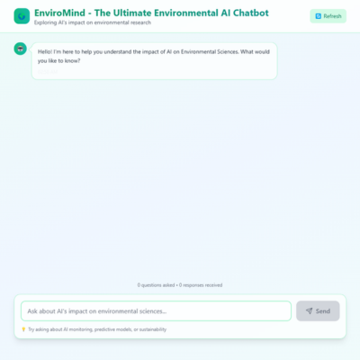
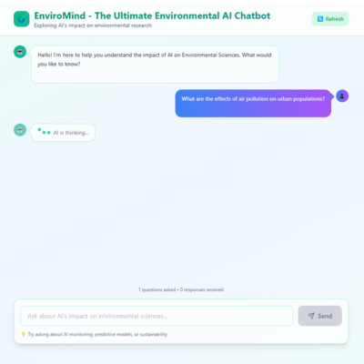
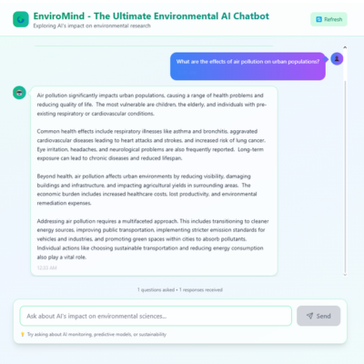
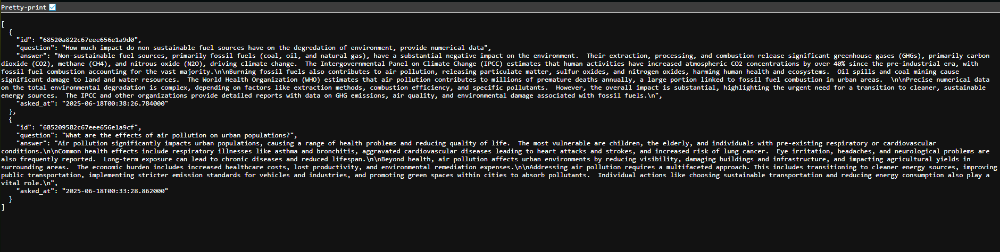
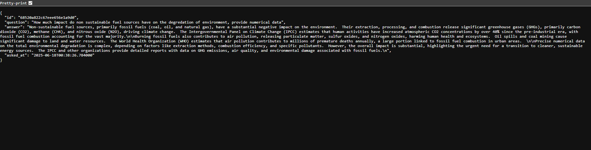
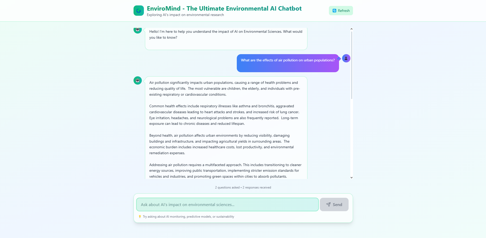

# 🌱 EnviroMind: Environmental AI Chatbot

EnviroMind is a full-stack AI chatbot focused on environmental awareness and education. It combines a React-based UI with a FastAPI backend and MongoDB database to deliver intelligent, structured answers to environmental questions.

---

## 🖥️ Local Setup Instructions

### 📦 Backend (FastAPI)

```bash
cd backend
pip install -r requirements.txt
```

Set the following environment variables:

- `GEMINI_API_KEY`: Your Gemini API key.
- `MONGO_URL`: Your MongoDB connection string (local or Atlas).
- `VITE_SERVER`: Frontend server URL (e.g., `http://localhost:8080`).

Start the FastAPI server:

```bash
uvicorn app.main:app --host 0.0.0.0 --port 8000
```

### 🌐 Frontend (React)

```bash
cd frontend
npm install
```

Set the following environment variable:

- `VITE_APP_API_BASE_URL`: Backend API base URL (e.g., `http://localhost:8000`).

Start the development server:

```bash
npm run dev
# Open http://localhost:8080 in your browser
```

### 🗄️ MongoDB Setup

- You can run MongoDB locally or create a free cluster on [MongoDB Atlas](https://www.mongodb.com/cloud/atlas).
- Update the `MONGO_URL` in your environment variables accordingly.
- Data is stored under the collection: `popeai.chats`.

---

## 🐳 Docker Setup

```bash
docker compose -f infra/docker-compose.yml up --build
```

Make sure to:

- Set backend env vars: `GEMINI_API_KEY`, `MONGO_URL`, `VITE_SERVER`
- Set frontend env var: `VITE_APP_API_BASE_URL`

---
## 🐘 UI Showcase

<p align="center">
  
  
  
</p>

---
## 🔌 API Endpoints

### POST `/api/chat`

**Request**

```json
{
  "question": "What are the effects of air pollution on urban populations?"
}
```

**Response**

```json
{
  "answer": "Air pollution significantly impacts urban populations, causing a range of health problems and reducing quality of life.  The most vulnerable are children, the elderly, and individuals with pre-existing respiratory or cardiovascular conditions.\nCommon health effects include respiratory illnesses like asthma and bronchitis, aggravated cardiovascular diseases leading to heart attacks and strokes, and increased risk of lung cancer.  Eye irritation, headaches, and neurological problems are also frequently reported.  Long-term exposure can lead to chronic diseases and reduced lifespan.\nBeyond health, air pollution affects urban environments by reducing visibility, damaging buildings and infrastructure, and impacting agricultural yields in surrounding areas.  The economic burden includes increased healthcare costs, lost productivity, and environmental remediation expenses.\nAddressing air pollution requires a multifaceted approach. This includes transitioning to cleaner energy sources, improving public transportation, implementing stricter emission standards for vehicles and industries, and promoting green spaces within cities to absorb pollutants.  Individual actions like choosing sustainable transportation and reducing energy consumption also play a vital role."
}
```

### GET `/api/chat`

Returns full chat history:

```bash
curl http://localhost:8000/api/chat
```




### GET `/api/chat/{id}`

Returns a specific chat:

```bash
curl http://localhost:8000/api/chat/123
```



---

## 💬 Frontend Usage

- Type a question in the input box and click **Send**
- The question appears in the chat window
- A loading spinner shows until the backend responds
- Response appears styled differently from user input
- Input is validated to ensure it's non-empty

**UI Screenshot Placeholder:**
> 

---

## 🚀 Live Deployment

- Frontend: [https://enviro-bot-gem.vercel.app](https://enviro-bot-gem.vercel.app)
- Backend: [https://enviro-bot-gem.onrender.com](https://enviro-bot-gem.onrender.com)
- Chat History (after at least one chat): [https://enviro-bot-gem.onrender.com/api/chat](https://enviro-bot-gem.onrender.com/api/chat)

---

## ❓ Unique Questions to Ask EnviroMind

1. What are the top 3 challenges in implementing circular economy in developing countries?
2. How does urban heat island effect relate to green infrastructure solutions?
3. Which renewable energy source is most viable for desert climates and why?
4. Explain how microplastics affect marine biodiversity and food chains.
5. What policies should universities adopt to become carbon-neutral by 2030?

These trigger responses with structured insights and actionable suggestions, written in under 300 words, following a friendly yet professional tone.

---

## ⚙️ Notes for Developers

- The core chatbot logic is handled in `backend/app/services/chatbot_service.py`
- Current AI provider is Gemini; replace API key or logic in `chatbot_response` function to change behavior

---

## 📄 License

This project is licensed under MIT License.